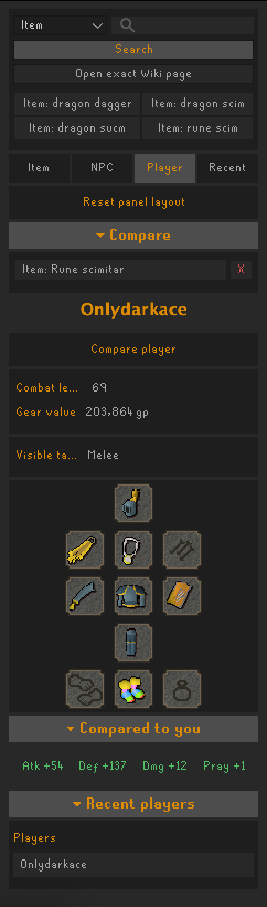
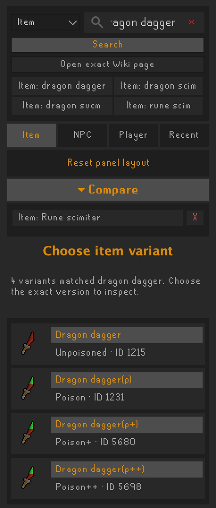
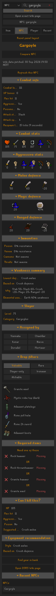
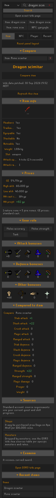

# Inspect

**Inspect player gear, compare equipment and look up NPCs and items in one RuneLite sidebar.**

Right-click a player to see their visible equipment and compare it with your own. Check an NPC's weaknesses and required items, find suitable gear in your bank, and look up item bonuses, requirements and acquisition sources.

## Get started

1. Open RuneLite's **Plugin Hub**, search for **Inspect** by **DevOldSchool**, and install it.
2. In Inspect's settings, turn on **Enable OSRS Wiki lookups** for item and NPC information. This is optional and off by default because it contacts the OSRS Wiki.
3. Right-click an item, NPC or player and choose **Inspect**, or open the magnifying-glass sidebar to search for an item or NPC.

Try searching for `dragon dagger` to choose an exact variant, or inspect a Slayer monster with your bank open and press **Find gear in bank**.

## What you can check

| Feature | What it shows |
| --- | --- |
| **Player inspect** | Visible equipment, estimated gear value and bonus comparisons against your own gear. Pin a player to compare with another. Disabled in PvP areas. |
| **NPCs and Slayer** | Combat stats, weaknesses, drops, Slayer details and required items checked against your inventory and equipment. |
| **Gear in your bank** | Up to three candidates per equipment slot, with score explanations and ranked bank highlights. |
| **Item details** | Equipment bonuses, requirements, acquisition sources and GE prices. |
| **Account-aware sources** | Quest and skill readiness, with suitable acquisition methods prioritised for Ironman accounts. |

Pin one item, NPC and player for comparisons. Choose exact item and NPC variants from search results, reopen recent inspections, and filter drops by categories such as rare, Slayer-only or alchable. Click section headings to collapse them; Inspect remembers your layout and preferred drop filter. **Reset panel layout** below the tabs expands all sections without changing your filter.

## Screenshots

Full panels from **Inspect 0.2.6**, with scrolling captures stitched together and overlapping content removed. Click an image to view it at its original resolution.

| Inspect player gear | Choose an exact item variant |
| --- | --- |
| <a href="images/player-inspect-0.2.6.png"></a> | <a href="images/item-variants-0.2.6.png"></a> |

| Explore NPC and Slayer details | Inspect and compare items |
| --- | --- |
| <a href="images/npc-inspect-0.2.6.png"></a> | <a href="images/item-inspect-0.2.6.png"></a> |

## How the estimates work

**Gear recommendations:** rankings use relevant accuracy + 1.5 × strength or magic damage percentage + 0.1 × Prayer. Hover a score for its calculation; unknown stats count as zero. This is a bonus comparison, not a DPS calculation: attack speed, special effects and equipment requirements are excluded. Two-handed weapons are marked `(2h)`; weapon and shield suggestions are alternatives rather than a complete compatible loadout. Click a candidate to inspect its requirements.

<details>
<summary>Alchemy estimate details</summary>

High-alch profit subtracts the item GE price and one nature rune plus five fire runes. Equipping a fire-rune-supplying staff or a charged Tome of fire removes the fire-rune cost, and the estimate updates when equipment changes. Missing rune prices leave it unavailable. Random rune savings and free Explorer's ring casts are excluded.

</details>

## Settings and data

Wiki-backed features can be toggled separately after enabling lookups. Player equipment inspection has its own toggle. **Inspect cache days** controls how long saved wiki data stays fresh.

- Item and NPC panels show their wiki data timestamp. **Refresh this item/NPC** reloads that entry; GE prices and local account checks are separate.
- If a lookup fails, valid saved data can be shown with a warning and its original timestamp. Cache controls let you clear saved entries.
- Wiki data is cached under your `.runelite` directory. Player equipment is read from locally visible client data; Inspect does not upload, store or crowdsource player gear.

Found missing or incorrect information? [Report an issue](https://github.com/DevOldSchool/inspect/issues) with the item or NPC name, exact variant and what you expected to see.

## Development

Requires Java 11. Build and test with:

```sh
./gradlew build
```

Launch a development client with `./gradlew run`. For login, follow RuneLite's [Using Jagex Accounts](https://github.com/runelite/runelite/wiki/Using-Jagex-Accounts) guide.

[GitHub Actions](https://github.com/DevOldSchool/inspect/actions) checks the latest RuneLite release on pushes, pull requests and daily. See [AGENTS.md](AGENTS.md) for development guidelines and [LICENSE](LICENSE) for the BSD-2-Clause licence.
